#### Note: I've now written a bigger, better (and more tested) tutorial, which you can find on [Medium](https://medium.com/@ynzc/getting-started-with-tdd-in-swift-2fab3e07204b)


This tutorial is a slimmed down and simplified version of the official Apple [*Start Developing iOS Apps with Swift*](https://developer.apple.com/library/prerelease/ios/referencelibrary/GettingStarted/DevelopiOSAppsSwift/Lesson7.html#//apple_ref/doc/uid/TP40015214-CH8-SW1) tutorial.

You will learn:

* How to build a basic iOS app
* Coding in Swift
* Using Xcode (IDEs: The beginning of the end or the end of the beginning. Discuss)
* Interface Builder - building (adaptive) interfaces


## Getting Started

1. Open up Xcode, and select `Create a New Xcode Project` then select 'Single View Application' under 'iOS -> Application' and click 'Next'. Make sure to set the language as Swift, set 'Devices' as 'Universal' and leave 'Use Core Data' unchecked

2. Welcome to Xcode! Let's go on a quick whistlestop tour:

  

 Run you app on your device or in the iPhone simulator by pressing the **Play** button:

 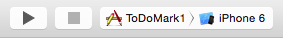

 You can toggle which areas are visible using the navigation buttons on the top-right of the screen

  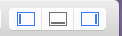

3. Let's have a quick review what's been generated for us:
  * **AppDelegate.swift**
    This creates the entry point to your app, and is where you define app-level actions (such as any custom actions to do on load or close of the app). We won't be making any changes to this file today.

  * **ViewController.swift**
    This is the custom subclass of the `UIViewController` class. ViewControllers are used to manage your views, so you can handle user interaction with the objects you are displaying in your `View`.

  * **Main.storyboard**
    Storyboards are (arguably) the most popular way to create the views for your app, and definitely the easiest to learn when you are getting started.

    > "A storyboard is a visual representation of the app’s user interface, showing screens of content and the transitions between them."

    Storyboard are edited using `Interface Builder`, a visual interface editor that come packaged with Xcode. Right now your storyboard should have one empty `scene`. Which is kinda dull.

  ## Creating our User Interface

  5. From the **Object Library** in the **Utility Area** (at the bottom right of the window), find a `Label`. Drag the label onto your empty scene.

    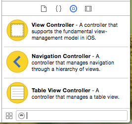

  6. Repeat with a `Text Field` and `Button`, laid out like this:

    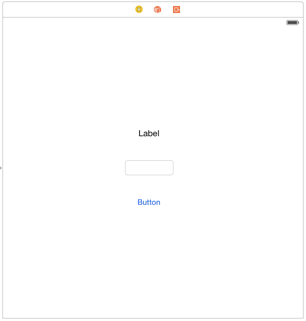

  7. Make it a little clearer for users - add some text to the `Label` and the `Button`. And let's make the text box wider.

    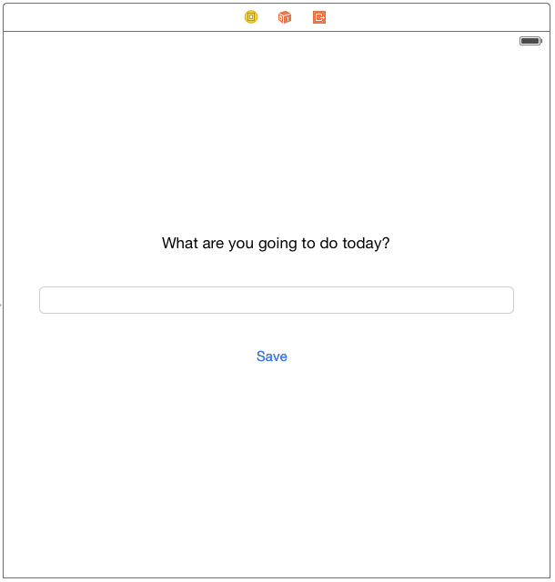

  8. Looks pretty good! Let's run the app to see how it's looking.

    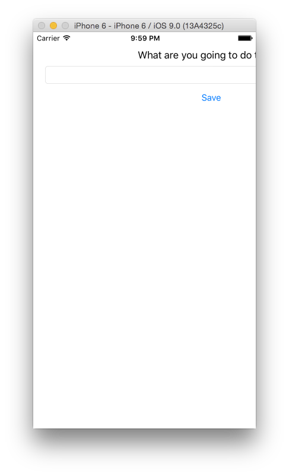

    Hmmmm ... that isn't really what we were aiming for. The text is going off the screen. What went wrong?


    What we're doing is building an *adaptive* interface, that will work on all sizes of screens. It needs to be responsive - which means we need to set some rules for the layout.

  9. For this we'll use a `UIStackView`. The stack view is an interface for laying out several subviews, either vertically or horizontally. It'll help us lay out our 3 elements neatly.

    Hold down **Shift** and select the `Label`, `Text Field` and `Button`. When they're selected, click on the `Stack` button.

    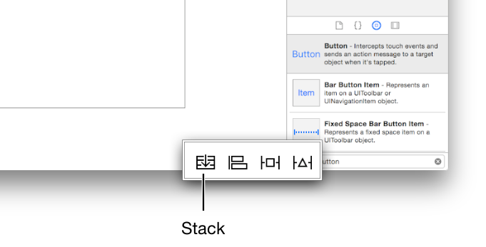

    They should now be embedded within a `Stack View`. You can see this if you pop out the Xcode **Outline View**. Yes, another view. Sorry. But this one is pretty useful! It shows us the hierarchy of element in our view.

    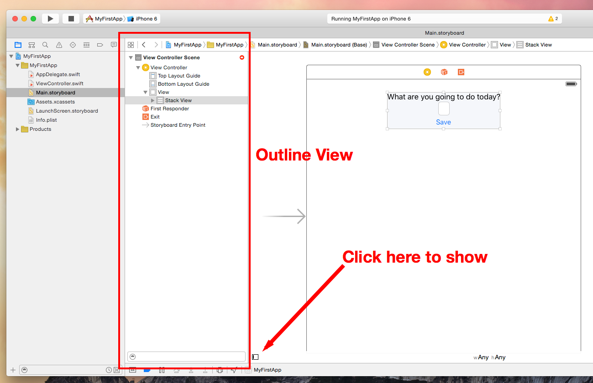

  10. I'm afraid it's time for ANOTHER view.<sup>1</sup> Missing Sublime Text yet? Head on over to the **Attributes Inspector**.To get to it, click the fourth button from the left in the inspector selector bar. It lets you edit the properties of an object in your storyboard.

    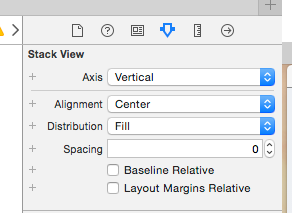

    Set the Spacing value of the `Stack View` to `12`. Also, set the `Alignment` to `Leading` and `Distribution` to `Fill`.

  11. Now we've set how our elements appear *within* the `Stack View`. Next, let's set out where the `Stack View` is placed within the `Scene`.
      1. Move it to the top of the scene.
      2. In the 'Outline View', hold CTRL and click-drag from the `Stack View` to the `View` listed in the view heirachy, and selected `Leading Space to Container Margin`, `Trailing Space to Container Margin` and `Vertical Spacing to Top Layout Guide.` - tip: if you hold SHIFT whilst clicking, you can select more than one at a time.
      3. Lastly we need to make out `StackView` fill the width of the screen. Select the `StackView` and open the 'Size Inspector' in the 'Utility Area'. (The button that looks like a ruler). Under the 'Constraints' heading we can see our 3 constraints that we just set before.

        

        Edit all three constraints in turn, making sure the constant value is set to 0. Your `StackView` size should update when you do this to fill the width of the Scene.

      4. Do the same for the `text field` so it spans the width of the `StackView`. CTRL-drag from the `text field` to the `StackView`. Add leading and trailing constraints, and make sure they are set to 0.

  12. Run the app! It should look something like this:

  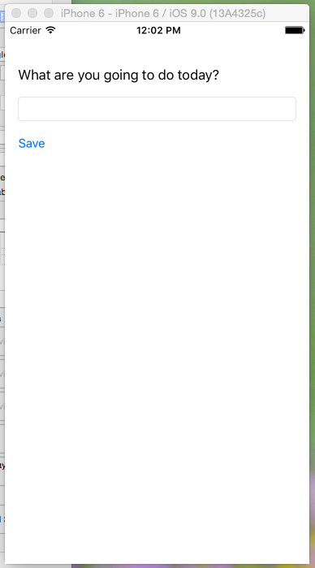

  Also, have a go at running your app in

  ## Connecting the UI to Code

 It probably hasn't escaped your notice than we haven't yet written a single line of code. What sort of programming is this? Fear not, it's time to put fingers to keyboards.

  First, it's important to understand the relationship between your `storyboards` and `view controllers`.

  > In a storyboard, a scene represents one screen of content and typically one view controller. View controllers implement your app’s behavior. They coordinate the flow of information between the app’s data model, which encapsulates the app’s data, and the views that display that data, manage the life cycle of their content views, handle orientation changes when the device is rotated, define the navigation within your app, and implement the behavior to respond to user input.

  When we created this app Xcode kindly created a scene (which we've been adding to). It also created the `ViewController.swift` file, and linked in to the scene. In this file, a new subclass of `UIViewController` called `ViewController`.

  Although the scene is already linked to the ViewController.swift, the elements  within the scene (like the text field and button) aren't linked.

  > AIM: When a user enters a to-do into the `text field`, and taps the `Save` button, the to-do they have entered is added to an array.

  13. Let's get started. Make sure you've got the `Main.storyboard` file open. Now open the **Assistant Editor**, which lets us view 2 files at once. If the right hand pane isn't showing the `ViewController.swift` file, select it from the 'Automatic' dropdown.

    

  14. Time to start hooking things up! CTRL-drag from the `text field` in the UI, into the code file, above the function declarations. In the dialog that appears, for 'Name', type `toDoTextField` and hit 'Connect'. Xcode will add the necessary code:

    `@IBOutlet var toDoTextField: UITextField!`

    The IBOutlet attribute tells Xcode that you have connected the nameTextField property from Interface Builder (which is why the attribute has the IB prefix). The rest of the declaration declares a variable of type UITextField named `toDoTextField`.

    So, our custom ViewController class now has one property - a textField.

  15. Next, let's create an array to hold our to-dos. For now we'll store them as strings.

    Under your textfield outlet, declare an array called `toDoArray`

    `var toDoArray : [String] = []`

    Our first written bit of Swift! Hurrah! Let's break it down.
    | code | meaning |
    | ----- | ------ |
    | var | Declares a new *mutable* variable |
    | toDoArray | Name of variable |
    | : [String]  | This variable will be an array [] of Strings |

  16. Action time! We need to define the trigger that will take the text from `toDoTextField`, and put it into the newly defined `toDoArray`. We know that the UI trigger will be the save button. To define the action in code, we're going to CTRL-drag from the button to the `ViewController.swift` file.

    In the dialog that appears select `Action` for Conneection, and call it `saveButtonTapped`. Then go ahead and click `Connect`.

    More generate code!

    ``` @IBAction func saveButtonTapped(sender: AnyObject) {
    }```

    Let's break it down again:

    @IBAction : Indicates that the method is an action that you can connect to from your storyboard in Interface Builder
    func : Method defining keyword (like `def` in Ruby)
    saveButtonTapped : The name of our method

  17. So, Xcode has generated the method declaration for us, but it's for us to define what happens when the button is tapped. Let's start with something simple - just to check the link has working.

    Lets give our new function something to do:
      `print("The button did a thing!")`

      That's right - it's a classic logging statement!.

      Let's build the project to check in what's happening on the simulator. Run your app, and tap on the `Save` button.

      On Xcode, a new view should pop up from the bottom of the screen.<sup>2</sup> This is the **Debugging Console**, which does lots of things, but most importantly right now it logs out our test statement.

  18. Riding on the wave of this success, and now that we know the UI is connected up to our `View Controller` let's try logging out whatever text the user enters into our text field. Within your `saveButtonTapped` function declare a new variable and assign it to the value of the text in the text field.

    `let toDoText = toDoTextField.text`

    Replace the argument in your `print()` call with `toDoText`, and run your app again. Type something in to your text field and tap `Save`. The debugger spits out:

    `Optional("Build something frankly awesome")`

    This isn't Swift's way telling you that you're to do item is an Optional task.

    The short explanation is that Swift introduces a new concept of `Optionals`. You can find a much more in depth explanation [here](https://developer.apple.com/library/ios/documentation/Swift/Conceptual/Swift_Programming_Language/TheBasics.html), but in short:

    > Optionals say either “there is a value, and it equals x” or “there isn’t a value at all”. <sup>3</sup>

    In order to get to the value within the variable we have to `unwrap` the optional by popping an `!` on the end of our variable. So change your print statement to say `print(toDoText!)` and give it a go.

    Voila! We're logging out the text we put in.

  19. Way back in the heady days of a few steps ago we prepared our array to store our to-dos. So let's add it in. Declare a new function called `addStringToArray` which takes one argument, which is a string called `toDoString`. The function will do this:
    `toDoArray.append(toDoString)`

    At the end of your `saveButtonTapped`, call your new `addStringToArray` function, passing in the text captured from the text field.

    Log out the `toDoArray` at the end of the function to check that it's worked.

  ## Time for Tables!

  20. Great! We're now accepting user input, and storing it. Next step is to show off all the to-dos we're storing.

    We're going to use a UITableView to do this. Not only do they look great, they are used *everywhere* in mobile applications. Check out your Settings, Email, Music, Contacts or Social Media apps if you don't believe me. UITableViews also come with a lot of functionality built-in, such as scrolling and gesture recognition.

    First we're going to drop a table into our `storyboard`. Open the right-hand drawer, and drag a `Table View` (not a `table view controller`) onto the scene, outside of the `StackView`. Open up the `Outline View` in Xcode by clicking on the button highlighted below.

    

    Now resize the `TableView` so that it occupies the remainder of the scene, we can do this by dragging its resize anchors in each direction until we are happy with it.

    Then in the `Outline View` CTRL-drag from the `Table View` to the parent 'View' and set the constraints for 'Leading Space to Container Margin', 'Trailing Space to Container Margin' and `Vertical Spacing to Bottom Layout Guide` Then CTRL-drag from the `Table View` to the `Stack View` and add a `Vertical Spacing` constraint.

    If you run the app now you will see a table view full of empty rows.

  21. Grab a `Table View Cell` for the `Object Library` and drop it into your `Table View`. Then drag a `Label` on the cell you just added. This will be the template for how our table displays each cell.

  22. Just as our main view has a View Controller, our new cell also needs a controller. Press CMD-N, and on the left of the dialog that appears, select `Source` under `iOS`. Select `Cocoa Touch Class`, and name your new class `ToDo`. It will be a subclass of `UITableViewCell`, so select this from the drop-down. Xcode will update the name of your class to make it the naming of the class clearer - this is fine. Make sure the language is set to `Swift`, and click `Next`, then `Create`. Again, Xcode has generated some code for the `ToDoTableViewCell`.

  23. Back in your `Main.Storyboard`, we're going to link the cell you dropped on the table to this new class. Select the cell, and go to the `Attributes inspector` in the right-hand drawer. Find the `Identifier` field and type `ToDoCell`.

    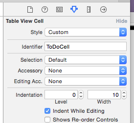

    In the previous tab (on the left) on the right-hand drawer, find the `Class` field. We want this cell to be of the new class we created, so go ahead and select (or type) `ToDoTableViewCell` into the field. In the `Module` field below, make sure your project name is selected

    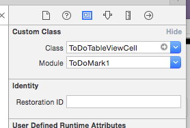

   24. Lastly for the cell, we need to add an outlet for the label in our new cell view controller. Open up the `Assistant Editor` and in the right-hand editor bring up the `ToDoTableViewCell.swift` file. Add an `@IBOutlet` for the label in the class, and name it `toDoCellLabel`. Check back to Step 14 if you need a reminder how to do this.

    Your cell now has a view controller, and storyboard identifier (which we'll use in a minute) and a single property (a label).

   ## Delegates and DataSources

   25. In order to display dynamic data a table view needs two important helpers: a data source and a delegate.

    >A table view data source, as implied by its name, supplies the table view with the data it needs to display. A table view delegate helps the table view manage cell selection, row heights, and other aspects related to displaying the data.

    If you have a custom view controller that contains a table view (like we do), the that view controller must comply with the `protocols` for the table view data source and delegate.

  26. Add these helpers to your `ViewController` class declaration (in the `ViewController.swift` file)

    `class ViewController: UIViewController, UITableViewDataSource, UITableViewDelegate { `

   26. In order to comply with the table view data source and delegate protocols we have to implement the following methods,:

    * `func numberOfSectionsInTableView(tableView: UITableView) -> Int`
    * `func tableView(tableView: UITableView, numberOfRowsInSection section: Int) -> Int`
    * `func tableView(tableView: UITableView, cellForRowAtIndexPath indexPath: NSIndexPath) -> UITableViewCell`

    If you try and run the app at this point you'll get a build failure, with a build error of `Type 'ViewController' does not conform to protocol 'UITableViewDataSource'`. Swift takes protocols very seriously.

    We'll take them one at a time.

    At the end of the View Controller Class, firstly add `// MARK: TableView DataSource and Delegate`. This helps group together our methods within the class.

    Next type:

    ``` func numberOfSectionsInTableView(tableView: UITableView) -> Int {
    return 1
    }```

    This function tells the table view how many sections to display. Sections are visual groupings of cells within table views, which is especially useful in table views with a lot of data. Our app is pretty simple, so we just need one.

   27. The second method we need to implement will tell our table view how many rows to display. We want to display all of the toDo's stored in our `toDoArray`, so we'll return the count of the array.

    ```func tableView(tableView: UITableView, numberOfRowsInSection section: Int) -> Int {
        return toDoArray.count
    }```

    28. Last, but definitely not least, we need to tell the table view what to display on each row. The function for this is:

      ```func tableView(tableView: UITableView, cellForRowAtIndexPath indexPath: NSIndexPath) -> UITableViewCell {
       let cellIdentifer = "ToDoTableViewCell"
       let cell = tableView.dequeueReusableCellWithIdentifier(cellIdentifer, forIndexPath: indexPath) as! ToDoTableViewCell
       return cell
       }```

       What are we doing here? First, we're declaring the unique identifier we used for our prototype cell in the storyboard. Next we're creating an instance of our custom cell class, and telling the table view to display it at the correct indexPath. We're then returning the cell.

   29. Let's also add some toDos to our array to get us started. Change the declaration of the `toDoArray` property to

    `var toDoArray : [String] = ["Eat", "Sleep", "Code"]`

    Run the app - what do you expect to see?

    Our array has 3 objects in it, so the table should have 3 rows with a label saying 'Label' in them. But it doesn't. What's wrong?

   30. What we're missing is a connection between the `TableView` on our UI, and the `tableView` we're trying to control in our delegate and datasource functions. At the moment our app is treating them as separate objects - our UI table view is acting blindly, and our code isn't controlling anything in the UI. So let's connect them up.

    First click-drag from the `Table View` on the storyboard to our `ViewController` class. As with the labels and text fields, we want to create an `@IBOutlet`, and call it `tableView`.

    Next, in the `viewDidLoad` function, add the following lines:

    ```override func viewDidLoad() {
        super.viewDidLoad()
        tableView.delegate = self
        tableView.dataSource = self
        }```

        All connected. Let's build again!

        Uh-oh. Our app has built succesfully, but then crashed.

  31. Go down to the 'debugger view' (at the bottom of the screen). We have a stack-trace here to help point us to the root of the problem:

    ```2015-09-06 18:34:02.371 ToDoMark1[3280:226704] *** Assertion failure in -[UITableView dequeueReusableCellWithIdentifier:forIndexPath:], /BuildRoot/Library/Caches/com.apple.xbs/Sources/UIKit_Sim/UIKit-3505.4/UITableView.m:6540
    2015-09-06 18:34:02.378 ToDoMark1[3280:226704] *** Terminating app due to uncaught exception 'NSInternalInconsistencyException', reason: 'unable to dequeue a cell with identifier ToDoTableViewCell - must register a nib or a class for the identifier or connect a prototype cell in a storyboard'
    *** First throw call stack:
    (
	0   CoreFoundation                      0x0000000108c849b5 __exceptionPreprocess + 165
	1   libobjc.A.dylib                     0x000000010a883deb objc_exception_throw + 48
	2   CoreFoundation                      0x0000000108c8481a +[NSException raise:format:arguments:] + 106
	3   Foundation                          0x00000001090ceb72 -[NSAssertionHandler handleFailureInMethod:object:file:lineNumber:description:] + 198```

    This key is this bit: "reason: 'unable to dequeue a cell with identifier ToDoTableViewCell - must register a nib or a class for the identifier or connect a prototype cell in a storyboard'"

    Our table view has tried to create a cell with the unique identifier "ToDoTableViewCell", but hasn't been able to find one.

    Go back to the storyboard, and check the identifier we gave our prototype cell.

    Woops! The identifier naming is wrong

    Correct the identifier to "ToDoTableViewCell", and let's try again.

    Third time lucky!

    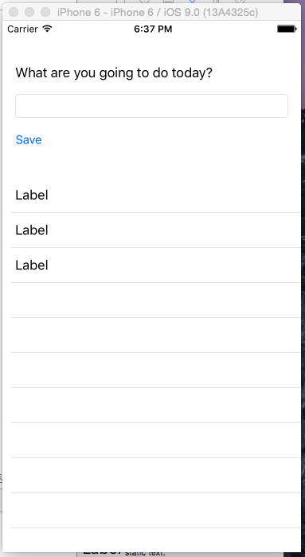

  32. Let's get our cells displaying the right to-do string. "Label" isn't a particularly descriptive to-do. In your `cellForRowAtIndexPath` function, before you `return cell` type in:

    `cell.toDoCellLabel.text = toDoArray[indexPath.row]`

    Run the app again to check that's working.

  33. So close! Finally, we need to refresh the table when we add a new todo. At the end of the `addStringToArray` function, type `        tableView.reloadData()`.

    SUCCESS!

    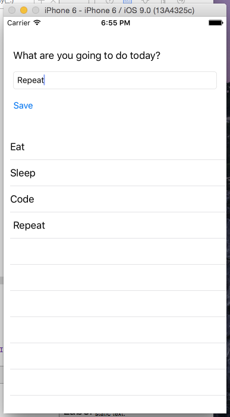

    Also, remember what we said about building an 'adaptive' interface? Why not trying running the app on an iPad simulator?


## Further Challenges

The UITableView documentation may come in handy for some of these: https://developer.apple.com/library/ios/documentation/UIKit/Reference/UITableViewDataSource_Protocol/

1. After adding a todo to your list, make sure the app clears the textfield, so that it's ready for your next task
2. What if we complete a todo? If a user selects (taps) a cell, make the text grey (or any other colour!) to indicate that it's done.
3. Completed to-dos piling up? Add 'swipe-to-delete' functionality to your table.
4. Let's be honest, right now the app is kind of an ugly duckling. Make it beautiful!

## Further Extensions

1. Test! Supoort for testing is growing an improving in iOS, and there are some great tools out there. Get started with XCTest and UITesting. Out `addStringToArray` function might be a good candidate for a unit test ...

2. Pomodoro timers are cool. Why not let our users tap on a to-do item to go to a new scene displaying your todo along with a 25 minute timer?


------

  <sup>1</sup> Don't worry kids. If children 6 years ago could figure this stuff out (for fun!), I'm have every confidence you can wrap your smart heads around Xcode's interface.

  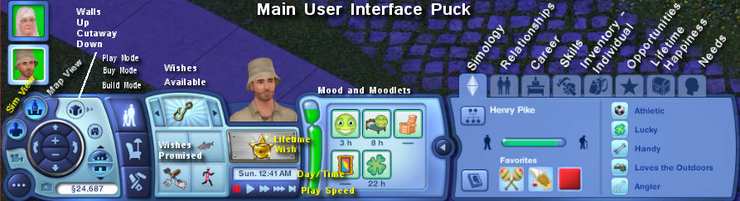

  <sup>2</sup> Legend tells of a drinking game new iOS devs were forced to play, where a shot of tequila was to be downed on every appearance of new view in Xcode. Needless to say, after it led to a global shortage of iOS developers, all records of the game were destroyed. Except this one.

  <sup>3</sup> [Alternatively](http://commandshift.co.uk/blog/2014/06/11/understanding-optionals-in-swift/), and more poetically: "Optionals are Swift's way of unifying the representation of Nothingness". No? Me neither.
